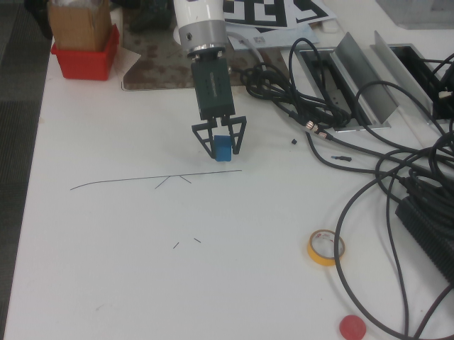

# Jaka_Demo
This is a grasping project based on jaka robotic arm. We use ROS1 and OpenCV(HSV or GRCNN) to grasp (eye out of hand).The project includes calculating hand-eye matrices, object recognition, and grasping codes include rt-x test.


## 实验思路
### 1.使用传统抓取方法获得抓取数据

已完成：\
1.机械臂网段设置，路由器设置，机械臂网络连接 \
2.机械臂APP基础运动控制（关节，移动）\
3.机械臂python接口调用 \
4.机械臂ROS接口调用 \
5.外置机械臂夹爪IO连接及python调用 \
6.外置夹爪攻击标定，融合ROS返回TCP坐标信息 \
7.机械臂ROS，Moveit联合调用，rviz仿真环境运动 \
8.基础HSV物块识别代码编写 \
9.识别代码ROS融合，创建新service，传递识别信息 \
10.相机标定，及手眼矩阵计算 \
11.识别坐标系转换代码编写 \
12.抓取逻辑代码编写 \
13.现有识别的基础上加入深度学习神经网络GRCNN分割识别 \
14.GRCNN分割代码ROS融合 \
15.加入undistortion代码，修正图像误差 

待完成：
1.数据采集代码修改
2.抓取误差修正

### 2.使用robotics-transformer进行自定义数据集训练实现抓取
已完成：

1.RT-1代码修改，增加RLDS数据集导入 \
2.RT-1分布式训练代码导入，修改 \
3.RT-X代码导入 \
4.RT-X修改，能运行基础数据集 \
5.RT-X docker打包image \
6.RT-X导入自己数据图片进行推理 \
7.加入USE词嵌入模型，对自定义语句进行词嵌入 \
8.自定义图片融合语义信息进行推理 

### 3.使用llama微调输出指令，对robotics-transforme进行控制

## General visual grasp(传统方法抓取，并储存训练需要的数据)(HSV or GRCNN)
### 1.Create a ros workspace
Create workspace：
```bash
mkdir -p ~/catkin_ws/src
cd ~/catkin_ws/src
catkin_init_workspace
```
Compile workspace：
```bash
cd ~/catkin_ws/
catkin_make
```
Set environment variables：
```bash
 echo "source ~/catkin_ws/devel/setup.bash" >> ~/.bashrc
```
Make the above configuration take effect on the current terminal：
```bash
source ~/.bashrc
```
### 3.Perform your own hand-eye calibration（进行自己的手眼标定）
#### Input
- image with chessboard
- robot pose in txt file (xyz(mm),rpy(deg))

#### Output
- camera intrinsic parameters
- eye hand transformations
  
more detail: https://github.com/ZiqiChai/simplified_eye_hand_calibration

### 4.Run
```bash
   roslaunch jaka_driver my_demo.launch
```

## Use a robotics transformer pre-trained model for inference（使用RT-X预训练模型进行推理）（RT-X pre-trained model）
### 1.Run

**CLICK** [here](https://github.com/AlexandreQ27/RT-X-Demo/tree/91c4622712b1ece0cc3290fcbb3f9d1481460da6) to see the step

## Train your own rt-1 model

## Acknowledgement
reference code: https://github.com/ZiqiChai/simplified_eye_hand_calibration
