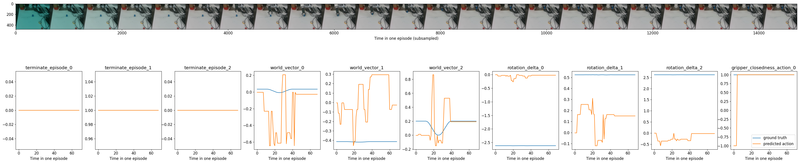

# RT-X-Demo
This is an implementation of RT-X on your own data.

## Getting Started
### 1.Download the code and pre-trained model
#### Download the code
```bash
      git clone git@github.com:AlexandreQ27/RT-X-Demo.git
```
#### Download the model
RT-X pre-trained model: [pre-trained model](https://console.cloud.google.com/storage/browser/_details/gresearch/robotics/open_x_embodiment_and_rt_x_oss/rt_1_x_tf_trained_for_002272480_step.zip;tab=live_object)

**Click** [here](https://storage.googleapis.com/gresearch/robotics/open_x_embodiment_and_rt_x_oss/rt_1_x_tf_trained_for_002272480_step.zip) or 

```bash
    gsutil -m cp "gs://gresearch/robotics/open_x_embodiment_and_rt_x_oss/rt_1_x_tf_trained_for_002272480_step.zip" .
```

to download pre-trained model and Unzip to the same path as the <code>.ipynb</code> file
## Docker
### 1.Install docker environment

### 2.Generating docker image

```bash
    docker build -t rt_x .
```

### 4.Run

```bash
    docker run -p 8888:8888 -it --rm --name rt_x rt_x
```

